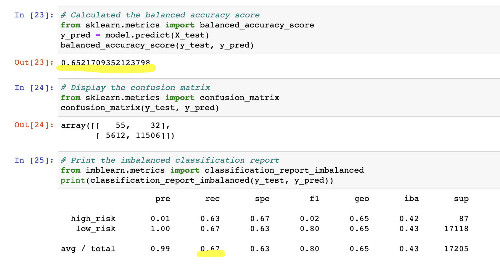
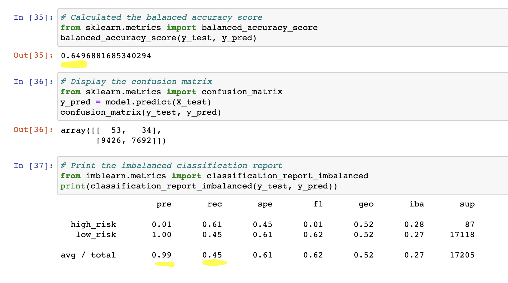
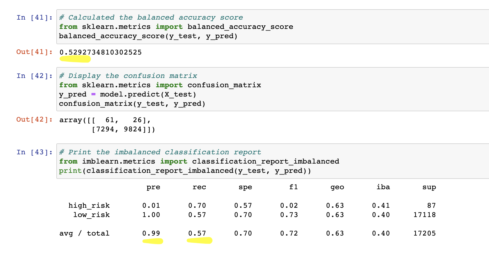
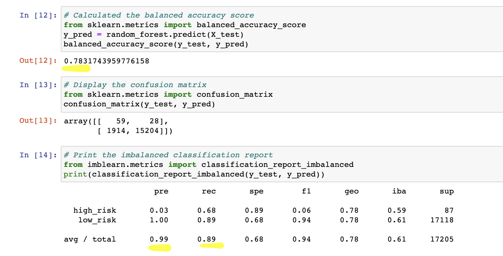
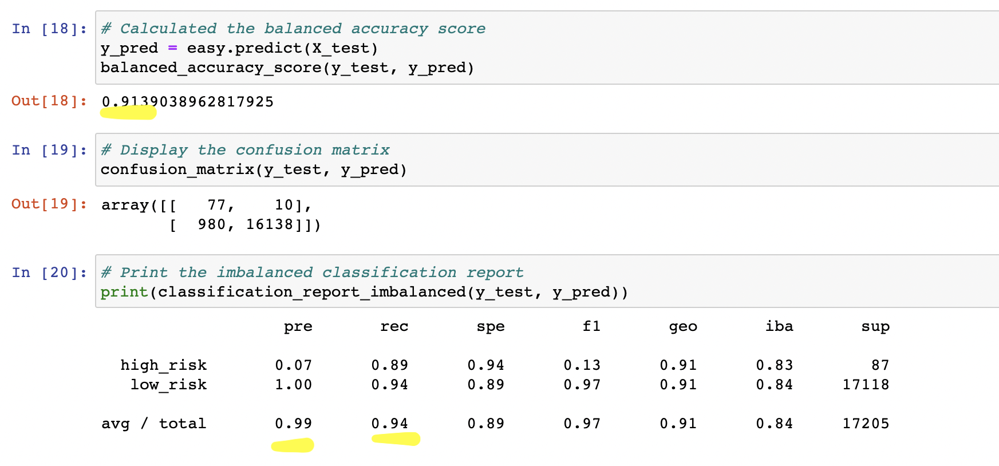

# Credit_Risk_Analysis - Module 17 Challenge
## Overview of the analysis
- Jill asked me to use imbalanced-learn and scikit-learn libraries to build and evaluate models using resampling.
- Used the credit card credit dataset from LendingClub, a peer-to-peer lending services company.
- oversample the data using the RandomOverSampler and SMOTE algorithms
- undersampled the data using the ClusterCentroids algorithm. 
- took combinatorial approach of over- and undersampling using the SMOTEENN algorithm. 
- compared two new machine learning models that reduce bias, BalancedRandomForestClassifier and EasyEnsembleClassifier, to predict credit risk. 
- evaluate the performance of these models.

## Results
- naive random oversampling 

balanced accuracy score is 65.2%
precision score 99%
recall score 67%

- SMOTE oversampling

balanced accuracy score is 65%
precision score 99%
recall score 67%

- undersampling

balanced accuracy score is 65%
precision score 99%
recall score 45%

- combination sampling

balanced accuracy score is 52.9%
precision score 99%
recall score 57%

- Balanced Random Forest

balanced accuracy score is 78.3%
precision score 99%
recall score 89%

- Easy Ensemble AdaBoost Classifier

balanced accuracy score is 91.4%
precision score 99%
recall score 94%

## Summary
undersampled, oversampled, combination and SMOTE models have poor accuracy score and low recall score. Balanced random forest and easy ensemble classifier have good accuracy and recall score. I recommend Easy ensemble adaboost classifier.